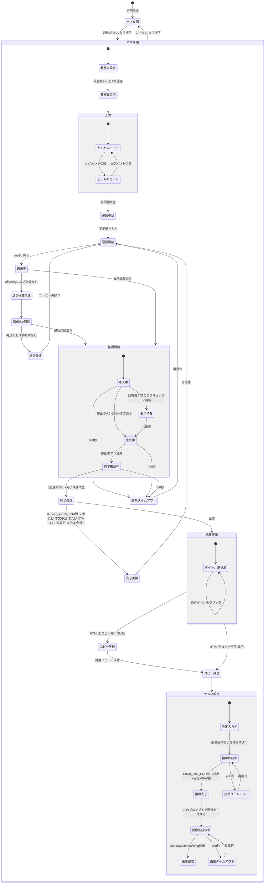

# ChatGPT版ブログ生成拡張機能 v0.4.0 棚卸し（設計図・デザイン作成用）

対象コード：`blog-generator-chatgpt.user.js`（このworktree内。4338行、`@version 0.4.0`）。
参照：`reference/chatgpt-extension-v0.4-design.md`（設計方針）、`tests/README.md`（モック環境の仕様）、`tests/shots/panel-a〜d.png`（実画面）。

本書に書いてあることは、すべてコード上に根拠がある事実だけです（推測で埋めた項目はありません）。各項目に関数名・行番号を付けています。行番号は上記の対象ファイルのものです。

---

## 1. 画面の骨格

### 1-1. 起動ボタン（ChatGPT画面に常設）

パネル未生成時のみ、ChatGPT画面左側に円形の起動ボタンを出す（`ensureButton()` 4253-4335行目）。

- 表示条件：`isNewChatPage()`（4248-4251行目）が真（パス `/`・`/c/...`・`/g/...`、多言語プレフィックス除去は`getChatRoutePath()` 4242-4246行目）で、かつパネル本体（`#${TOOL_ID}`）がまだ存在しない場合。それ以外のパス（例：設定画面）では既存ボタンを削除し `setChatAvoidance(false)` を呼ぶ（4254-4258行目）。
- 見た目：直径60px、オレンジ地・紺枠の円ボタン。左端固定・縦中央（`position:fixed; left:12px; top:50%`、4270-4291行目）。ペン＋星のSVGアイコン（4295-4316行目）。
- 生成直後に `eisai-btn-pulse` アニメーションを4回再生（4329-4330行目、CSSは2213-2221行目）。
- `title`属性：「英才ブログ生成ツールを開く」（4293行目）。ラベルテキストなし（アイコンのみ）。
- 押すと `buildPanel({ forceOpen: true })`（4332-4334行目）。
- `setInterval(ensureButton, 1000)`（4337行目）で1秒ごとに再評価（ChatGPTのSPA遷移でボタンが消えていないか等を継続監視）。

### 1-2. パネル本体（`#${TOOL_ID}`、`buildPanel()` 2617-4237行目）

固定位置（`position:fixed; top:0; right:0; width:420px(=PANEL_WIDTH); height:100vh`、1946行目）。`z-index:2147483647`。折りたたみ時は `transform:translateX(100%)`（1953-1955行目、`.collapsed`クラス）。

構造は縦方向に4段：

1. **ヘッダー**（`.eisai-header`、2654-2725行目）：左に「英才ブログ生成」タイトル＋バージョン表示＋（テストモード時のみ）「テストモード」バッジ。右に「テストON/OFF」ボタン・「更新」ボタン・「←」閉じるボタン。
2. **ステップ表示**（`.eisai-steps`、2730-2738行目）：①教室→②入力→③生成→④仕上げ→⑤サムネの5点をドット＋ラベルで表示（`refreshDynamicUi()` 2764-2794行目が状態から都度計算）。
3. **本文スクロール域**（`content`、2742行目、`overflow:auto; flex:1`）：教室情報カード→入力モード切替→記事の型→記事入力フォーム→（生成後）タイトル/チェック/要確認カード→サムネイルカード、の順に縦積み。
4. **下部固定アクションバー**（`.eisai-action-bar`、2745-2749行目、`position:sticky; bottom:0`）：状態表示（statusDiv）→不足項目ヒント（missingHint）→主・副ボタン行（actionRow）の3段構成で常時表示。

パネルの外側に、右端に張り出す縦書きの「📝 英才ブログ生成」タブボタン（`#eisai-toggle-btn`、2646-2652行目）が常設され、パネルの開閉トグルとして機能する（折りたたみ時は`right:0`に移動、1994-2005行目）。

### 1-3. 開閉・幅・ChatGPT側レイアウトへの影響

- 開閉状態は `localStorage['eisai_collapsed']`（'true'/'false'）に保存（`setPanelCollapsed()` 262-269行目）。次回訪問時も維持される。
- パネルを開いている間（`syncChatAvoidance()` 271-278行目が`.collapsed`が無く`display!=='none'`と判定した時）、`setChatAvoidance(true)`（237-255行目）が`document.documentElement`と`document.body`に`eisai-chatgpt-panel-open`クラスを付け、CSS変数`--eisai-chatgpt-panel-width`(=420px)・`--eisai-chatgpt-tab-width`（トグルボタンの実測幅、無ければ42px=`PANEL_TAB_WIDTH_FALLBACK`）・`--eisai-chatgpt-reserved-width`（両者の合計）をbodyにセットする。
- そのクラスが付いている間、ChatGPT本体の `main`・`[role="main"]`・`#thread-bottom-container`・`form[data-type="unified-composer"]`等の幅・右マージンをCSS（1959-1993行目）で縮め、パネルの下に隠れないようにする。
- ただし `setChatAvoidance()` 内で `shouldApply = enabled && window.innerWidth > 900` （238行目）としているため、**ウィンドウ幅900px以下では、パネルを開いていてもChatGPT側レイアウトの回避（幅縮小）が行われない**（`@media (max-width:900px)`側でも明示的に元の全幅に戻す、2009-2018行目）。
- リサイズ時は `bindChatAvoidanceResize()`（280-286行目）が`window`の`resize`イベントで`syncChatAvoidance()`を再計算する。

---

## 2. 部品一覧（表）

表示文言は原文のまま（絵文字・句読点含む）。「保存先」は永続化されるlocalStorageキー（無ければ「―」）。

### 2-1. パネル外・常設部品

| 表示文言 | 種類 | セクション | 表示条件 | 押せる条件 | 処理（関数） | 保存先 |
|---|---|---|---|---|---|---|
| （アイコンのみ／`title`="英才ブログ生成ツールを開く"） | 起動ボタン | ChatGPT画面 | `isNewChatPage()`真 かつ パネル未生成（4253-4259行目） | 常時 | `buildPanel({forceOpen:true})`（4332-4334行目） | ― |
| 「📝 英才ブログ生成」 | タブ状トグルボタン（`#eisai-toggle-btn`） | パネル右端外 | パネル生成後は常時 | 常時 | `setPanelCollapsed()`（262-269, 2650-2652行目） | `eisai_collapsed` |

### 2-2. ヘッダー

| 表示文言 | 種類 | セクション | 表示条件 | 押せる条件 | 処理（関数） | 保存先 |
|---|---|---|---|---|---|---|
| 「英才ブログ生成」＋`v0.4.0` | 見出し・ラベル | ヘッダー | 常時 | ― | ― | ― |
| 「テストモード」 | バッジ（状態表示） | ヘッダー | `isTestModeEnabled()`真の時のみ（2658-2670行目） | ― | ― | ― |
| 「テストON」／「テストOFF」 | 2段階確認ボタン | ヘッダー | 常時（ラベルは状態で切替、2674-2699行目） | 常時 | `armTwoStepButton()`→1回目「もう一度で切替」→2回目`setTestModeEnabled()`＋`buildPanel()`再構築 | `eisai_chatgpt_test_mode_enabled` |
| 「更新」 | 2段階確認ボタン | ヘッダー | 常時（2701-2725行目） | 常時 | 1回目「もう一度で確認」→2回目 `window.open(UPDATE_URL+キャッシュバスト)` | ― |
| 「←」 | 閉じるボタン | ヘッダー | 常時（2714-2718行目） | 常時 | `setPanelCollapsed(...,true)` | `eisai_collapsed` |

### 2-3. ステップ表示

| 表示文言 | 種類 | セクション | 表示条件 | 押せる条件 | 処理 | 保存先 |
|---|---|---|---|---|---|---|
| 「教室」「入力」「生成」「仕上げ」「サムネ」＋番号/✓ | 進捗ドット（非活性表示） | ステップバー | 常時（2729-2738行目） | 押せない（クリック不可） | `refreshDynamicUi()`（2764-2794行目）が教室完了・送信中・生成済・サムネ表示・画像完了検知の5条件から`active`を1〜6算出 | ― |

### 2-4. 教室情報カード（`
` 2797-2883行目）

| 表示文言 | 種類 | セクション | 表示条件 | 押せる条件 | 処理 | 保存先 |
|---|---|---|---|---|---|---|
| 「教室情報設定（必須：校舎名・申込URL）」／1行要約（例「◯◯校／室長未設定／申込URL✓／電話–／LINE✓」）＋「編集」 | アコーディオン見出し | 教室カード | 未完了時は見出し固定＋開状態、完了時は要約＋「編集」チップ＋閉状態（`renderClassroomSummary()` 2830-2844行目） | 「編集」チップ含め`
`全体がクリックでdetails開閉（ネイティブ挙動） | ― | ― |
| 「校舎名（記事に反映されます）」＋必須ピル | テキスト入力 | 教室カード | 常時 | 常時 | `saveBtn.onclick`でまとめて保存（2848-2868行目） | `eisai_classroom_settings_persistent`（+互換ミラー`eisai_chatgpt_blog_info_v040`） |
| 「室長名（本文では名前のみ使用・フルネーム可）」 | テキスト入力 | 教室カード | 常時 | 常時 | 同上 | 同上 |
| 「地域・駅名（冒頭あいさつ用・任意）」 | テキスト入力 | 教室カード | 常時 | 常時 | 同上 | 同上 |
| 「近隣の対象校（カンマ区切り・任意）」 | テキスト入力 | 教室カード | 常時 | 常時 | 同上 | 同上 |
| 「申込フォームURL（https://必須）」＋必須ピル | テキスト入力 | 教室カード | 常時 | 常時 | 同上 | 同上 |
| 「電話番号（CTAの電話ボタン用・任意）」 | テキスト入力 | 教室カード | 常時 | 常時 | 同上 | 同上 |
| 「LINE URL（CTAのLINEボタン用・任意）」 | テキスト入力 | 教室カード | 常時 | 常時 | 同上 | 同上 |
| 「住所（任意）」 | テキスト入力 | 教室カード | 常時 | 常時 | 同上 | 同上 |
| 「アクセス（任意）」 | テキスト入力 | 教室カード | 常時 | 常時 | 同上 | 同上 |
| 「受付時間（任意）」 | テキスト入力 | 教室カード | 常時 | 常時 | 同上 | 同上 |
| 「教室情報を保存」 | 主ボタン相当（secondary） | 教室カード | 常時（2847行目） | 常時（テストモード中は`saveSetting`せずトースト表示のみ、2849-2852行目） | `saveSetting()`（323-339行目）→`renderClassroomSummary()`／`refreshDynamicUi()` | 同上 |
| 「テストモード中です。架空の教室情報を使用し、保存済みの本番教室情報は上書きしません。」 | 注意書き（状態表示） | 教室カード内 | `isTestModeEnabled()`真の時のみ（2870-2883行目） | ― | ― | ― |

### 2-5. 入力モード／記事の型

| 表示文言 | 種類 | セクション | 表示条件 | 押せる条件 | 処理 | 保存先 |
|---|---|---|---|---|---|---|
| 「かんたん（メモ）」 | セグメントボタン | 入力モード | 常時（2921行目） | 常時 | `saveInputMode('easy')`→`renderTypeButtons()`/`renderArticleForm()`（2902-2920行目） | `eisai_chatgpt_input_mode_v040` |
| 「しっかり（項目別）」 | セグメントボタン | 入力モード | 常時（2922行目） | 常時 | `saveInputMode('detailed')`→同上（切替時`currentArticleType`が`auto`なら`solve`に強制、2911-2913行目） | 同上 |
| 「メモを書くだけ。AIが事実を拾って記事にします。」／「項目ごとに書くと、狙いどおりの記事になりやすいです。」 | 説明文（状態表示） | 入力モード直下 | モードに応じて切替（`updateSegmentDesc()` 2898-2900行目） | ― | ― | ― |
| 「悩み解決型（情報提供）」 | 型選択ボタン | 記事の型 | 常時（2948行目） | 常時 | `currentArticleType='solve'`→`renderArticleForm()` | ― |
| 「ストーリー型（事例・イベント・体験）」 | 型選択ボタン | 記事の型 | 常時（2949行目） | 常時 | `currentArticleType='story'` | ― |
| 「おまかせ（メモから判断）」 | 型選択ボタン | 記事の型 | **かんたんモードの時だけ**（2950-2952行目） | 常時 | `currentArticleType='auto'` | ― |

（記事の型自体はlocalStorageに単独保存されず、`articleInput.type`として記事入力ドラフトに含めて保存される＝2-6の保存先を参照。）

### 2-6. 記事入力フォーム（`renderArticleForm()` 3314-3368行目、フィールド定義は`ARTICLE_FIELDS` 3068-3088行目）

かんたんモード：メモ欄（必須）＋「詳しく指定（任意）」の中に型選択・学年等9項目。しっかりモード：型選択の下に6枚のカード（誰に／悩み／家庭でできること／教室でやっている事実／事例・当日の様子／CTA・関連記事・写真）。

| 表示文言 | 種類 | セクション | 表示条件 | 押せる条件 | 処理 | 保存先 |
|---|---|---|---|---|---|---|
| 「書きたいこと・教室でやったこと」＋必須ピル＋文字数カウンタ＋「例を入れる」 | 大テキストエリア＋補助ボタン | かんたんモード（`renderEasyMemoField()` 3263-3312行目） | かんたんモードの時のみ | 常時 | input/changeで`articleInput.memo`更新→`saveArticleDraft()`。「例を入れる」はサンプル文を流し込む（3304-3308行目） | `eisai_chatgpt_article_draft_v040` |
| 「誰に：学年」（選択）／「誰に：対象校」／「誰に：時期・きっかけ」 | セレクト／テキスト | 誰に | しっかりは常時カード内、かんたんは「詳しく指定」内 | 常時 | `mountField()`（3233-3254行目） | 同上 |
| 「悩み1〜3（セリフで）」 | テキスト入力 | 悩み（しっかりのみ表示） | `modes:[DETAILED]` | 常時 | 同上 | 同上 |
| 「家庭でできること1〜3（手順で）」 | テキスト入力 | 家庭でできること（しっかりのみ） | `modes:[DETAILED]` | 常時 | 同上 | 同上 |
| 「教室でやっている事実…」＋必須ピル（しっかりのみ） | 大テキストエリア | 教室の事実 | `modes:[DETAILED]`・`requiredModes:[DETAILED]` | 常時 | 同上 | 同上 |
| 「事例・当日の様子（任意。書いたことだけが記事に出ます）」 | 大テキストエリア | 事例（しっかりのみ） | `modes:[DETAILED]` | 常時 | 同上 | 同上 |
| 「この記事でつなげたい行動」（選択） | セレクト | CTA他 | 常時 | 常時 | 同上 | 同上 |
| 「締切・特典（任意）」（しっかりのみ） | テキスト入力 | CTA他 | `modes:[DETAILED]` | 常時 | 同上 | 同上 |
| 「目安の文字数」（選択、既定1800-2200） | セレクト | CTA他 | 常時 | 常時 | 同上 | 同上 |
| 「関連記事1〜3（任意）」 | テキスト入力 | CTA他 | 常時 | 常時 | 同上 | 同上 |
| 「用意できる写真（任意…）」 | テキスト入力 | CTA他 | 常時 | 常時 | 同上 | 同上 |
| （型別サンプルのラベル、例「枡形中テスト対策（サンプル）」） | 補助チップ | 型ラベル行右 | `isTestModeEnabled()`真の時のみ（`renderSampleButton()` 3195-3231行目） | 常時 | `ARTICLE_TEST_SAMPLES`の値を全フィールドへ一括代入 | 同上 |
| 「入力をクリア」 | 2段階確認ボタン | 型ラベル行右 | 常時（3037-3056行目） | 常時 | 1回目「もう一度でクリア」→2回目`clearArticleForm()`（3371-3375行目、`clearArticleDraft()`＋フォーム再構築） | 削除：`eisai_chatgpt_article_draft_v040` |
| 「入力内容を表示 ▼」／「入力内容を閉じる ▲」 | アコーディオン見出し（`#eisai-input-accordion`） | 入力欄の上 | 生成完了後のみ表示（`collapseInputForResult()` 2985-2989行目で`display:block`に） | 常時 | クリックで`step2`の表示切替（2980-2984行目） | ― |

### 2-7. 送信系ボタン（下部固定アクションバー・生成前）

| 表示文言 | 種類 | セクション | 表示条件 | 押せる条件 | 処理 | 保存先 |
|---|---|---|---|---|---|---|
| 「プロンプトをコピー」 | 副ボタン（`copyPromptBtn`） | アクションバー | 生成完了前は常時表示（`syncFooterButtons()` 3683-3689行目で生成後は隠す） | 常時（押下時に必須未入力なら中断） | `collectMissingLabels()`が0件なら`buildPromptForCurrentInput()`をクリップボードへコピー（4091-4108行目） | ― |
| 「ChatGPTで記事を作る」 | 主ボタン（`genBtn`） | アクションバー | 生成完了前は常時表示 | 未入力必須があれば押せても即トースト＋フォーカス移動で中断（3996-4001行目）。送信中は`disabled`（`setGenerateBusy()` 3980-3985行目） | `genBtn.onclick`（3993-4088行目）：送信→送信確認→（失敗時1回再送）→完了監視 | ― |

### 2-8. 状態表示・不足ヒント（アクションバー最上部）

| 表示文言 | 種類 | セクション | 表示条件 | 押せる条件 | 処理 | 保存先 |
|---|---|---|---|---|---|---|
| （送信中／生成中／完了／失敗などの文言、詳細は§7） | 状態表示（`statusDiv`） | アクションバー | `.show`クラスが付いた時のみ可視（初期は非表示、CSS 2154-2160行目） | ― | 各処理から`textContent`を都度書き換え | ― |
| 「あとN項目：（不足ラベルの一覧）」 | 警告ヒント（`missingHint`） | アクションバー | 未入力必須があり・未生成・送信中でない時のみ（`refreshDynamicUi()` 2768-2774行目） | クリックで最初の不足欄までスクロール／教室未完了なら教室カードを開く（2750-2759行目） | ― | ― |

### 2-9. 生成後カード（`content`内、生成前は`display:none`）

| 表示文言 | 種類 | セクション | 表示条件 | 押せる条件 | 処理 | 保存先 |
|---|---|---|---|---|---|---|
| 「① タイトルを選ぶ」＋説明文 | カード見出し | titleSection | `lastTitleCandidates.length>=2`の時のみ`display:block`（`renderTitleCandidates()` 1209-1243行目） | ― | ― | ― |
| 「① SEO重視（n文字）」「② 共感重視（n文字）」「③ CV重視（n文字）」＋タイトル本文 | 選択チップ（3枚） | titleSection | 上と同条件 | 常時（クリックで即反映） | `applyTitleToBlogHtml()`（1186-1197行目）が`lastBlogHtml`のh1を書き換え＋`setGeneratedContext()` | `eisai_chatgpt_last_generated_context` |
| 「② チェック」＋タイトル/構成/教室情報/可視性/CTA/ベネフィット/事実のみの○△×チップ＋備考＋実測行 | カード | checkSection | `renderCheckAndMetrics()`（1250-1285行目）が生成完了時に`display:block` | ― | ○△×は`EISAI_CHECK`コメントの内容をそのまま表示、実測は`computeArticleMetrics()`（1890-1920行目） | ― |
| 「③ 要確認（n件：入力に無いかもしれない箇所）」／「③ 要確認なし（…）」＋各行「［発言/曜日/数字］…前後15字…」 | カード | unverifiedSection | `renderUnverifiedList()`（1288-1311行目）が生成完了時に`display:block` | ― | `findUnverifiedClaims()`（998-1116行目）の結果を列挙 | ― |
| 「手動コピー用：下の欄をタップ（クリック）すると全選択されます。そのままコピーしてください。」＋読み取り専用テキストエリア | 手動コピー欄 | manualCopyBox | クリップボード書込失敗時のみ`showManualCopyBox()`（3481-3484行目）で表示 | クリック/フォーカスで全選択（3478-3479行目） | ― | ― |

### 2-10. 生成後の主・副ボタン（アクションバー、生成後に切替）

| 表示文言 | 種類 | セクション | 表示条件 | 押せる条件 | 処理 | 保存先 |
|---|---|---|---|---|---|---|
| 「HTMLをコピー（エディタへ）」 | 主ボタン（`copyBtn`） | アクションバー | 生成完了時のみ表示（3447行目、`syncFooterButtons()`で`genBtn`と排他） | 常時 | クリップボードへ`lastBlogHtml`をコピー、成功/失敗でトースト分岐、サムネ欄を開く（4111-4160行目） | ― |
| 「エディタを開く」 | 副ボタン（`openEditorBtn`） | アクションバー | 生成完了時のみ表示 | 常時 | `window.open('https://tools.eisai.org/blogs/editor-icons.html','_blank')`（3450-3453行目） | ― |

### 2-11. サムネイルカード（`imgSection`、コピー成功後に`display:block`）

| 表示文言 | 種類 | セクション | 表示条件 | 押せる条件 | 処理 | 保存先 |
|---|---|---|---|---|---|---|
| 「参照してほしい写真（…）があれば、画像生成前にこのチャットへアップロード（添付）してください。…」 | 注意書き | サムネカード先頭 | サムネカード表示時は常時（3499-3511行目） | ― | ― | ― |
| 「1 設定（タイトル・文字の強さ・色）」＋説明文「画像は実写スタイルで生成されます。…」 | 見出し＋説明 | thumbStep1 | 常時 | ― | ― | ― |
| 「サムネイルのメインにするタイトル」（選択） | セレクト | thumbStep1 | 常時 | `populateThumbnailTitleOptions()`（3538-3561行目）で選択肢生成時のみ意味を持つ（未取得時は1件のみで実質固定） | 選択値が`imgGenBtn.onclick`内で`sourceBlogTitle`として使用 | ― |
| 「文字の強さを選択」（標準／強め／最大インパクト、既定：強め） | セレクト | thumbStep1 | 常時 | 常時 | `TEXT_IMPACT_OPTIONS`の説明文を画像プロンプトに埋め込む | ― |
| 「メインカラーを選択」／「サブカラーを選択」（お任せ＋9色、既定：お任せ） | セレクト | thumbStep1 | 常時 | 常時 | `COLOR_STYLES`から`colorScheme`文言を生成 | ― |
| 「サムネイルテキスト設定（任意）」 | アコーディオン | thumbStep1 | 常時 | 常時 | 開閉のみ | ― |
| 「おまかせモード（ブログから自動抽出）」 | チェックボックス（既定ON） | thumbStep1内 | 常時 | 常時 | OFFにすると下の3欄を表示（3647-3649行目） | ― |
| 「メインキャッチフレーズ（必須）」／「サブキャッチフレーズ（任意）」／「ポイント・特徴（任意）」 | テキスト入力 | thumbStep1内 | おまかせOFFの時のみ表示 | 常時 | `imgGenBtn.onclick`内で読み取り | ― |
| 「2 画像用の指示を作る」＋「画像用の指示を作る」ボタン | 見出し＋主ボタン（`imgGenBtn`） | thumbStep2 | 常時 | 常時（クリックで巨大プロンプトを組み立てて送信、3696-3935行目） | §6参照 | ― |
| 「3 画像を生成する」＋「②の指示づくりが終わると、ここに生成ボタンが表示されます。」 | 見出し＋案内文 | thumbStep3 | `imgExecBtn`が非表示の間だけ案内文を表示（`syncThumbStep3Placeholder()`＋`MutationObserver`、3675-3679行目） | ― | ― | ― |
| 「このプロンプトで画像を生成する」 | 副ボタン（`imgExecBtn`） | thumbStep3 | サムネ指示生成完了時のみ表示（`watchThumbnailPrompt()`内、2552-2553行目） | 常時（押すたびに再送信可、失敗時も隠さない） | §6参照 | ― |

### 2-12. トースト（`#eisai-copy-toast`、`showToast()` 736-751行目）

パネル内`content`の末尾に常設される、数秒で消える一時メッセージ欄。`alert()`/`confirm()`を使わない代替（733-735, 753行目コメント）。表示文言は§7参照。

---

## 3. 状態の一覧

各状態について「表示されるもの」「押せるもの」「状態表示の文言」「次への遷移条件」を示す。§7で全文言を再掲するため、ここでは要約する。

| # | 状態 | 表示されるもの | 押せるもの | 状態表示文言（例） | 次への遷移条件 |
|---|---|---|---|---|---|
| 1 | 教室未設定 | 教室カード開・見出しのみ（`renderClassroomSummary()`のelse分岐 2840-2843行目） | 全入力欄＋保存ボタン | ― | `isClassroomComplete()`＝name・url両方入力→状態2へ（`saveBtn.onclick`後） |
| 2 | 教室設定済・折りたたみ | 1行要約＋「編集」チップ、カード閉（2833-2839行目） | 「編集」で再展開（ネイティブdetails） | ― | 「編集」クリックで一時的に開くのみ、状態自体は変わらない |
| 3 | 入力モード：かんたん | メモ欄＋「詳しく指定」 | 入力モード/型ボタン、メモ、詳細欄 | ― | セグメント押下で状態4へ |
| 4 | 入力モード：しっかり | 6カードの項目別フォーム | 同上 | ― | セグメント押下で状態3へ（`auto`選択中なら`solve`に強制変更） |
| 5 | 記事の型：悩み解決型／ストーリー型／おまかせ | `selectedTypeText`の文言切替 | 型ボタン | ― | ボタン押下で切替。おまかせはかんたんモード限定 |
| 6 | 必須不足 | `missingHint`表示（あとN項目） | 主ボタンは押せるがクリックしても送信されない | 「あとN項目：…」 | 不足欄をすべて入力→ヒント消灯（状態7へ） |
| 7 | 送信可能 | ヒント非表示 | 「ChatGPTで記事を作る」／「プロンプトをコピー」 | ― | genBtn押下で状態8へ |
| 8 | 送信中 | `genBtn`が`disabled`・半透明（`setGenerateBusy(true)`） | 主ボタン押せない、他は操作可 | 「📨 送信中…」 | `confirmSendSucceeded()`が真→状態10へ、偽→状態9へ |
| 9 | 送信確認・再送 | 同上 | 同上 | 「📨 送信を確認できなかったため、もう一度送信します…」 | 再送後さらに確認失敗なら状態11へ、成功なら状態10へ |
| 10 | 送信成功・監視開始 | 同上 | 同上 | 「📨 ブログ生成用プロンプトを送信しました。生成が完了したら、下にコピー用ボタンが出ます。」 | `watchBlogResponseAndEnableCopy()`開始→状態12/13へ |
| 11 | 送信失敗 | `genBtn`復帰、`copyPromptBtn`に`eisai-btn-pulse`点滅（`promotePromptCopyButton()` 3988-3991行目） | 全操作可能（再送や「プロンプトをコピー」を促す） | 「⚠️ ChatGPTへの送信を確認できませんでした（失敗）。…」 | ユーザーの再操作待ち（自動遷移なし） |
| 12 | 考え中（回答欄未検出） | ヘッダー～フォーム操作可 | 同上 | 「🧠 ChatGPTが考えています…（n秒）」（停止ボタンのみ検出時）。16秒無反応なら「⚠️ ChatGPTの回答欄をまだ検出できません。…」（隠れた分岐、`noSignalCount===16`） | 回答ノード出現で状態13へ、480秒(8分)無反応なら状態17へ |
| 13 | 表示待ち（生成停止直後・本文まだ空） | 同上 | 同上 | 「⏳ ChatGPTの表示を待っています…」（`isGenerationStopped && !hasArticleStart`の隠れた分岐、2331行目） | 本文に`<h1`出現で状態14/15へ |
| 14 | 生成中n文字 | 同上 | 同上 | 「🧠 ChatGPTが生成中です…（n文字）」 | 停止ボタン消滅で状態15へ |
| 15 | 完了確認中n文字 | 同上 | 同上 | 「⏳ 生成完了を確認しています…（n文字）」 | テキストが5回連続変化なし＋停止ボタン無し＋完了条件成立→状態16へ。480秒超過で状態17へ |
| 16 | 完了（後処理） | HTML抽出・CTA差替・EISAI_CHECK抽出・実測・要確認判定を実行（2352-2474行目） | ― | 成功時「✅ 記事の生成が完了しました。下のボタンからHTMLをコピーできます。」。失敗時は状態18群へ分岐 | 成功→状態19（結果表示）。各失敗分岐→状態18 |
| 17 | タイムアウト | ― | プロンプトコピーへの誘導が強調される | 回答欄自体が出ない場合「⚠️ 生成完了を検出できませんでした（タイムアウト・回答欄未検出）。…」／回答はあるが完了しない場合「⚠️ 生成完了を検出できませんでした（タイムアウト）。…」 | ユーザーの再操作待ち |
| 18 | 完了処理内の失敗（複数の隠れた分岐） | `copyBtn`は出さない | ― | ①h1もCTA_DATA_ENDも出ない「⚠️ ChatGPTの出力からブログHTMLを検出できませんでした（失敗）。…」②本文不足（`hasEnoughArticleHtml()`偽）「⚠️ ブログ本文が途中までしか取得できませんでした（失敗）。…」③CTA URL未設定「⚠️ CTAリンク先URLが未設定です（失敗）。…」④例外「⚠️ ブログHTMLの処理中にエラーが発生しました（失敗・…）」 | ユーザーの再操作待ち（プロンプトコピー誘導なし＝③④はpromotePromptCopyButtonを呼ばない隠れた非対称） |
| 19 | 完了・結果表示 | タイトル/チェック/要確認カード表示、入力欄はアコーディオンに畳まれる（`collapseInputForResult()`） | タイトルチップ、HTMLコピー、エディタを開く | 「✅ 記事の生成が完了しました。…」 | 「HTMLをコピー（エディタへ）」押下で状態20へ |
| 20 | コピー成功 | トースト表示、サムネカード出現 | サムネ設定一式 | 「✅ HTMLをコピーしました。\n英才ブログエディタの原稿欄に貼り付けてください。」（2秒で自動消灯） | ユーザーがサムネ設定へ進む |
| 21 | コピー失敗 | `manualCopyBox`表示（自動では消えない） | 手動コピー欄クリックで全選択 | 「⚠️ コピーできませんでした。下のHTML表示から手動でコピーしてください。」 | 次回コピー成功時に隠れる（`hideManualCopyBox()`） |
| 22 | 要確認0件 | 緑背景（`--eisai-green-bg`） | ― | 「③ 要確認なし（入力に無い発言・曜日・数字は見つかりませんでした）」 | ― |
| 23 | 要確認あり | オレンジ背景（`#fff7ed`） | ― | 「③ 要確認（n件：入力に無いかもしれない箇所）」＋各行 | ― |
| 24 | サムネ欄表示 | thumbStep1〜3 | 設定一式＋「画像用の指示を作る」 | ― | `imgGenBtn`押下で状態25へ |
| 25 | 指示作成中 | `copyBtn`/`imgExecBtn`を一旦隠す（3918-3919行目） | ― | 「🎯 画像生成用プロンプトを作成しています...」→（考え中と同型の）「🧠 ChatGPTが考えています…（n秒）」／16秒無反応で「⚠️ ChatGPTの回答欄をまだ検出できません。…」 | `[[EISAI_IMG_PROMPT]]`マーカー検出＋3回連続同一＋80字超で状態26へ。480秒でタイムアウト（状態27） |
| 26 | 指示完了 | `imgExecBtn`表示 | 「このプロンプトで画像を生成する」 | 「✅ 画像生成用プロンプトの出力が完了しました。…」 | 押下で状態28へ |
| 27 | 指示タイムアウト | ボタンは押せる状態のまま | 再実行可 | 「⚠️ サムネイル指示の生成完了を検出できませんでした。…」 | 再度「画像用の指示を作る」押下 |
| 28 | 画像生成依頼 | ChatGPT生成中なら最大20秒待機（隠れた分岐、4186-4192行目） | `imgExecBtn`は隠さず押し直し可能 | 待機中「🖼 ChatGPTの応答が終わるのを待っています...」→送信後「🖼 画像生成を依頼しました。…数分かかることがあります…」 | 画像`0>`検出で状態29、8分で状態30 |
| 29 | 画像完成 | ステップ表示が全完了（⑥扱い、`thumbnailImageDetected=true`→`active=6`、2785行目） | ― | 「✅ 画像ができました。ChatGPTの画像をクリックして開き、保存してください（右上のダウンロード）。」 | ― |
| 30 | 画像タイムアウト | ボタンは押せる状態のまま | 再実行可 | 「⚠️ 8分経っても画像の完成を確認できませんでした。…」 | 再度実行 |
| 31 | テストモードON | 教室に架空データ（`TEST_CLASSROOM`）を強制使用、サンプル入力ボタン出現、教室保存は無効化 | ― | バッジ「テストモード」＋注意書き | テストOFFボタンで状態32へ（パネル再構築） |
| 32 | テストモードOFF | 通常の教室設定を使用 | ― | ― | テストONボタンで状態31へ |
| 33 | 2回押し確認中（3種：テスト切替／更新確認／入力クリア） | ボタン文言が変化（「もう一度で切替」/「もう一度で確認」/「もう一度でクリア」） | 4秒以内に同じボタンを再度押すと実行、押さないと自動で元の文言に戻る（`armTwoStepButton()` 755-775行目） | ― | 4秒でタイムアウト＝状態変化なしで元に戻る（隠れた分岐：`revertMs`既定4000ms） |
| 34 | 更新確認 | ― | ― | ― | 「更新」2回目押下で`UPDATE_URL`をキャッシュバスト付きで新規タブに開くのみ（実際に新バージョンかどうかの判定はコード側にはない＝ユーザーがraw scriptページを見て自分で判断する設計） |

### 3-1. コード上でたどり着くが画面上で分かりにくい隠れた分岐

- **DOM構造の違いによる本文抽出の3経路**（`pickBestChatgptTurnText()` 576-604行目）：ChatGPTの「writing block」（`.ProseMirror`子要素連結）／`.markdown`要素／ターン全体テキスト、の3候補から`<h1`を含むものを優先し、その中で最長のものを採用。どの経路を通ったかはユーザーには一切表示されない。
- **JSON応答パス**（`parseBlogJsonResponse()`→`renderBlogJsonHtml()`、2362-2366行目）：ChatGPTがJSON形式で返した場合だけ通る分岐。実際のプロンプト（`buildBlogPromptV3()`）は常にHTML（`<h1>`開始）を指示しているため、通常運用では到達しない可能性が高い（§8参照）。
- **新語彙（`eisai-cta`）／旧語彙（`buildCtaHtml`）の分岐**（`hasEisaiCta`判定、2418-2424行目）：生成された本文にeisai-ctaクラスがあるかどうかだけで、CTAの組み立て方法全体が変わる。ユーザーには見えない。
- **`window.innerWidth>900`によるレイアウト回避の有効/無効**（238行目）：ウィンドウ幅だけで、パネルを開いてもChatGPT側の表示が縮むかどうかが変わる。
- **`GENERATED_CONTEXT_MAX_AGE_MS`（24時間）超過による生成コンテキストの自動消去**（1317-1320行目）：24時間経過後にlocalStorageの記録が黒く削除されるが、ユーザーへの通知は無い。
- **`noSignalCount===16`（約16秒）の警告表示**：考え中表示の途中で一度だけ警告文に変わる細かい閾値（2296-2299, 2515-2519行目）。

---

## 4. 状態遷移（Mermaid）

---

## 5. データ

### 5-1. 教室設定（`getSetting()` 292-321行目／`saveSetting()` 323-339行目）

| 項目キー | 画面ラベル | 必須（UI上のピル） | 必須（実際の送信判定） |
|---|---|---|---|
| `name` | 校舎名 | ○（2801行目） | ○（`isClassroomComplete()`2826行目、`collectMissingLabels()`3941行目） |
| `manager` | 室長名 | ×（2802行目でrequiredPill未指定） | ○（`collectMissingLabels()`3942行目のみ。`isClassroomComplete()`は見ない） |
| `area` | 地域・駅名 | × | × |
| `schools` | 近隣の対象校 | × | × |
| `url` | 申込フォームURL | ○（2805行目） | ○（両方で判定） |
| `tel` | 電話番号 | × | × |
| `line` | LINE URL | × | × |
| `address` | 住所 | × | × |
| `access` | アクセス | × | × |
| `hours` | 受付時間 | × | × |

- 保存先：`eisai_classroom_settings_persistent`（`CLASSROOM_STORAGE_KEY`、バージョン非依存・全バージョン共通）。
- 互換ミラー：`eisai_chatgpt_blog_info_v040`（`STORAGE_KEY`、`CURRENT_VERSION`から動的生成＝`v${VERSION_KEY}`。**バージョンを上げるとキー名も変わる**、39行目）に、`kosha`（←name）・`shichou`（←manager）という**旧フィールド名**も含めて保存する（331-335行目）。
- 読込時（`getSetting()`）は、テストモードなら`TEST_CLASSROOM`（50-61行目、`kosha`/`shichou`エイリアス付き）を返し、通常時は`CLASSROOM_STORAGE_KEY`→`STORAGE_KEY`（旧`kosha`/`shichou`含む）の順にフォールバックしてマージする（304-321行目）。

### 5-2. 記事入力（`ARTICLE_FIELDS` 3068-3088行目、ドラフト保存は`saveArticleDraft()`350-356行目）

- 保存先：`eisai_chatgpt_article_draft_v040`（`ARTICLE_DRAFT_STORAGE_KEY`、44行目コメントに「バージョン非依存の固定キー」と明記＝将来`CURRENT_VERSION`が上がってもキー名はそのまま`v040`で変わらない）。
- 共通項目：`type`（`solve`/`story`/`auto`）、`mode`（`easy`/`detailed`）。
- モード別の必須（`requiredModes`で指定）：
  - かんたん（`easy`）：`memo`のみ必須。
  - しっかり（`detailed`）：`grade`・`facts`が必須（`w1〜w3`・`h1〜h3`・`caseText`・`offer`は任意）。
- モード別の表示可否（`modes`未指定＝両モードで表示）：`memo`はかんたんのみ、`w1〜w3`・`h1〜h3`・`facts`・`caseText`・`offer`はしっかりのみ。`grade`・`tSchools`・`timing`・`action`・`length`・`r1〜r3`・`photos`は両モード共通。
- 既定値：`length`は`'1800-2200'`（`defaultArticleInput()` 3145-3151行目。プロンプト側`buildBlogPromptV3()`の既定値391行目とv0.4.1で統一済み、と390行目コメントに明記）。

### 5-3. 生成結果（`setGeneratedContext()` 1328-1343行目／`restoreGeneratedContext()` 1345-1352行目）

- 保存先：`eisai_chatgpt_last_generated_context`（`GENERATED_CONTEXT_STORAGE_KEY`）。TTL 24時間（`GENERATED_CONTEXT_MAX_AGE_MS`＝24*60*60*1000ms、46行目）。期限切れ・JSON解析失敗時は自動削除（1317-1324行目）。
- 保存されるフィールド：`blogHtml`・`articleFacts`・`blogTitle`・`updatedAt`。
- **保存されないモジュール変数**（ページ再読込やパネル再構築で消える）：`lastTitleCandidates`・`lastEisaiCheck`・`lastArticleMetrics`・`lastUnverifiedClaims`（103-117行目で宣言、`restoreGeneratedContext()`は`blogHtml`/`articleFacts`/`blogTitle`しか復元しない）。

### 5-4. サムネイル設定

- `thumbTitleSelect`・`textImpactSelect`（既定「強め」）・`mainColorSelect`／`subColorSelect`（既定「お任せ」）・`toggleSwitch`（おまかせ、既定ON）・`mainCatchInput`／`subCatchInput`／`pointsInput`：**いずれもlocalStorageに保存されない**（DOM上の値のみ）。パネル再構築（例：テストモード切替）や画面再読込で初期値に戻る。

### 5-5. その他の永続キー

| キー | 用途 | バージョン依存性 |
|---|---|---|
| `eisai_chatgpt_test_mode_enabled` | テストモードON/OFF | 非依存（固定文字列、42行目） |
| `eisai_chatgpt_input_mode_v040` | 入力モード（かんたん/しっかり） | **文字列としては固定**（`CURRENT_VERSION`変数と連動しない、76行目） |
| `eisai_collapsed` | パネル開閉状態 | 非依存 |
| `eisai_classroom_settings_persistent` | 教室設定本体 | 非依存 |
| `eisai_chatgpt_blog_info_v040` | 教室設定の互換ミラー（旧`kosha`/`shichou`含む） | **`CURRENT_VERSION`から動的生成**（バージョンが上がるとキー名が変わる） |
| `eisai_chatgpt_article_draft_v040` | 記事入力ドラフト | 文字列としては固定（44行目コメントで明言） |
| `eisai_chatgpt_last_generated_context` | 生成結果コンテキスト（24h TTL） | 非依存 |

---

## 6. 外部とのやり取り（ChatGPT DOM依存）

すべて `CHATGPT_ADAPTER`（606-717行目）に集約。

| メソッド | セレクタ／方法 | 備考 |
|---|---|---|
| `getComposer()`（607-621行目） | `#prompt-textarea` → `[contenteditable="true"][id="prompt-textarea"]` → `div.ProseMirror[contenteditable="true"]` → `textarea#prompt-textarea` → `main form textarea` → `main form [contenteditable="true"]`（先勝ち。自パネル内の要素は`closest('#${TOOL_ID}')`で除外） | 入力欄取得 |
| `setComposerText()`（624-646行目） | `<textarea>`/`<input>`はプロトタイプの`value`セッターを直接呼んでReactの検知を回避＋`input`/`change`イベント発火。`contenteditable`は`execCommand('selectAll')`→`execCommand('insertText')`＋`InputEvent('input')` | テキスト流し込み |
| `send()`（648-673行目） | 250ms待機後、`#composer-submit-button`（2026-09-23確認・design.md記載）→`button[data-testid="send-button"]`→`button[data-testid="composer-send-button"]`→`form button[type="submit"]`→`button[aria-label*="Send"]`→`button[aria-label*="送信"]`のうち`disabled`でも`aria-disabled`でもない最初の1つをクリック。見つからなければ入力欄への`Enter`keydownイベントでフォールバック | 送信 |
| `getResponseNodes()`（675-690行目） | `[data-message-author-role="assistant"]`全件のうち`pickBestChatgptTurnText()`が空でないもの | 応答ターン一覧 |
| `getResponseText()`（692-696行目） | 引数ノードの最も近い`[data-message-author-role="assistant"]`祖先に対し`pickBestChatgptTurnText()` | 応答本文取得 |
| `pickBestChatgptTurnText()`（576-604行目） | ①`[data-testid="writing-block-container"] .ProseMirror`（子要素ごとのtextContentを`\n`連結）②ターン内の全`.markdown`③ターン全体、の3種の候補を集め、`button`/`svg`/`.sr-only`/`[data-testid^="writing-block-header"]`/`[data-testid^="writing-block-suggested-followups"]`を除去（`cleanChatgptClone()`554-564行目）した上で、`<h1`を含む候補群があればその中の最長、無ければ全候補中の最長を採用 | 3レイアウト差異（writing-block／markdown／stale）を吸収する中核ロジック |
| `isGenerating()`（698-711行目） | `button[data-testid="stop-button"]`／`button[data-testid="composer-stop-button"]`／`button[aria-label*="Stop"]`／`button[aria-label*="stop"]`／`button[aria-label*="停止"]`／`button[aria-label*="中止"]`のいずれかが`disabled`でなく`aria-disabled!=='true'`で存在するか | 生成中判定 |
| `getUserMessageCount()`（714-716行目） | `[data-message-author-role="user"]`の件数 | 送信成功確認用 |

**完了判定**（`looksCompleteBlogHtml()` 2239-2243行目）：デコード済みテキストが`<h1`を含み、かつ`EISAI_CHECK`（新語彙）または`<!--CTA_DATA_END-->`（旧語彙）のいずれかを含む。

**タイムアウト値**：
- 送信成功確認：8秒（`confirmSendSucceeded()` 800行目、300ms間隔ポーリング）。
- ブログ本文監視：480秒＝8分（`watchBlogResponseAndEnableCopy()` 2281行目、1秒間隔）、安定判定は5回連続同一テキスト（`stableCount>=5`、2323行目）。
- サムネ指示監視：480秒＝8分（`watchThumbnailPrompt()` 2495行目、1秒間隔）、安定判定は3回連続同一（`stableCount>=3`）＋抽出テキスト80字超（2544行目）。
- 画像生成監視：480秒＝8分（`watchGeneratedImage()` 2584行目、1秒間隔）。
- 画像生成依頼前の「生成中なら待つ」：最大20秒（`imgExecBtn.onclick`内、4189行目、500ms×40回）。
- 「考えています」から警告表示に変わるまで：16秒（`noSignalCount===16`、2297・2516行目）。

---

## 7. 文言一覧

ユーザーに見える全メッセージを原文のまま列挙する。重複・古い文言には注記を付けた。

### 7-1. 状態表示（`statusDiv.textContent`、全24箇所）

| 行 | 文言 |
|---|---|
| 2293, 2512 | 🧠 ChatGPTが考えています…（{n}秒） **（2箇所に同一表現が別関数で重複定義）** |
| 2298 | ⚠️ ChatGPTの回答欄をまだ検出できません。生成が終わっているのにボタンが出ない場合は、少し待つか再生成してください。 |
| 2305 | ⚠️ 生成完了を検出できませんでした（タイムアウト・回答欄未検出）。下の「📋 プロンプトをコピー」からChatGPTの入力欄に貼って送信してください。 |
| 2332 | ⏳ ChatGPTの表示を待っています… |
| 2335-2337 | ⏳ 生成完了を確認しています…（{n}文字） ／ 🧠 ChatGPTが生成中です…（{n}文字）（同じ行で条件分岐） |
| 2345 | ⚠️ 生成完了を検出できませんでした（タイムアウト）。ChatGPTの生成が止まっているか確認し、下の「📋 プロンプトをコピー」からChatGPTの入力欄に貼って送信してください。 |
| 2377 | ⚠️ ChatGPTの出力からブログHTMLを検出できませんでした（失敗）。下の「📋 プロンプトをコピー」からChatGPTの入力欄に貼って、もう一度送信してください。 |
| 2396 | ⚠️ ブログ本文が途中までしか取得できませんでした（失敗）。赤いコピーは出さずに止めています。もう一度「**ChatGPTへ送信して記事生成**」を押すか、下の「📋 プロンプトをコピー」をお使いください。 **【古い文言】現行ボタンは「ChatGPTで記事を作る」（3381行目）であり一致しない** |
| 2408 | ⚠️ CTAリンク先URLが未設定です（失敗）。教室情報設定でURLを保存してから、もう一度生成してください。 |
| 2452 | ⚠️ ブログHTMLの処理中にエラーが発生しました（失敗・{メッセージ}）。下の「📋 プロンプトをコピー」からChatGPTの入力欄に貼って、もう一度送信してください。 |
| 2458 | ✅ 記事の生成が完了しました。下のボタンからHTMLをコピーできます。 |
| 2517 | ⚠️ ChatGPTの回答欄をまだ検出できません。生成が終わっているのにボタンが出ない場合は、少し待つか再度お試しください。 **（2298行目とほぼ同義で微妙に文末だけ違う言い回しの揺れ）** |
| 2525, 2565 | ⚠️ サムネイル指示の生成完了を検出できませんでした。ChatGPTの生成が止まっているか確認し、もう一度お試しください。 **（2箇所に完全同一文が重複定義）** |
| 2556 | ✅ 画像生成用プロンプトの出力が完了しました。内容を確認のうえ、①ChatGPTの画像生成が使える状態か確認し、②「このプロンプトで画像を生成する」ボタンを押して生成をスタートしてください。 |
| 2597 | ✅ 画像ができました。ChatGPTの画像をクリックして開き、保存してください（右上のダウンロード）。 |
| 2608 | ⚠️ 8分経っても画像の完成を確認できませんでした。ChatGPTの画面を直接確認してください（進んでいれば、そのまま少し待てば表示されます）。 |
| 3916 | 🎯 画像生成用プロンプトを作成しています... |
| 4021 | 📨 送信中… |
| 4056 | 📨 送信を確認できなかったため、もう一度送信します… |
| 4063 | ⚠️ ChatGPTへの送信を確認できませんでした（失敗）。ChatGPT側の画面をご確認のうえ、下の「📋 プロンプトをコピー」からChatGPTの入力欄に貼って送信してください。 |
| 4070 | 📨 ブログ生成用プロンプトを送信しました。生成が完了したら、下にコピー用ボタンが出ます。 |
| 4083 | ⚠️ 予期しないエラーが発生しました（失敗・{メッセージ}）。下の「📋 プロンプトをコピー」からChatGPTの入力欄に貼って、もう一度送信してください。 |
| 4102 | 📋 プロンプトをコピーしました。ChatGPTの入力欄に貼って送信してください。 |
| 4187 | 🖼 ChatGPTの応答が終わるのを待っています... |
| 4213 | ⚠️ 画像生成の依頼を送信できませんでした。ChatGPTの入力欄を確認して、もう一度「このプロンプトで画像を生成する」を押してください。 |
| 4220 | 🖼 画像生成を依頼しました。ChatGPTが画像を生成します（数分かかることがあります）。\n進まない・「生成できませんでした」と出た場合は、もう一度このボタンを押すと生成されることが多いです。 |

### 7-2. トースト（`showToast()`呼び出し・全13箇所、うち重複4箇所）

| 行 | 文言 |
|---|---|
| 780, 3747, 4016, 4181 | ChatGPTの入力欄が見つかりませんでした **（同一文が4箇所で独立に重複定義）** |
| 2696-2698 | テストモードをONにしました。架空教室情報とサンプル入力ボタンが使えます。 ／ テストモードをOFFにしました。 |
| 2850 | テストモード中は架空の教室情報を自動使用します。通常の教室情報は上書きしません。 |
| 2865 | 教室情報を保存しました |
| 3055 | 入力内容をクリアしました |
| 3719 | サムネイル作成に使うブログ本文が見つかりませんでした。\n先にブログ生成を完了してから、もう一度お試しください。 |
| 3998, 4094 | 次の項目を入力してください（あと{n}件）\n・{不足欄の一覧} **（同一パターンが2箇所） |
| 4106 | プロンプトのコピーに失敗しました。お使いのブラウザでクリップボードへのアクセスが許可されているかご確認ください。 |
| 4113 | コピーできるブログHTMLがまだありません。\nまずは「**ChatGPTへ送信して記事生成**」を実行してください。 **【古い文言】上記2396行目と同種の齟齬** |
| 4165 | ChatGPTの出力が見つかりませんでした。サムネイル指示の生成が完了してからもう一度試してください。 |

### 7-3. トースト本文の直接書き換え（`toast.textContent`）

| 行 | 文言 |
|---|---|
| 1234 | タイトルを反映しました：{title} |
| 4131 | ✅ HTMLをコピーしました。\n英才ブログエディタの原稿欄に貼り付けてください。 |
| 4134 | ⚠️ コピーできませんでした。下のHTML表示から手動でコピーしてください。 |

### 7-4. ヒント・説明・見出し類（抜粋）

| 行 | 文言 |
|---|---|
| 2770 | あと{n}項目：{不足ラベルの一覧} |
| 2894-2895 | メモを書くだけ。AIが事実を拾って記事にします。 ／ 項目ごとに書くと、狙いどおりの記事になりやすいです。 |
| 3311 | 日付・人数・学校名・学年・教科・講師名・生徒の様子や一言があると、記事が濃くなります（書いたことだけが記事に出ます）。 |
| 3410 | SEO重視／共感・ベネフィット重視／CV（行動）重視の3案です。タップで記事のタイトルが差し替わります（33字を超えると赤で表示）。 |
| 3463 | 手動コピー用：下の欄をタップ（クリック）すると全選択されます。そのままコピーしてください。 |
| 3511 | 参照してほしい写真（生徒のノート・答案・教室の様子・講師や室長の人物写真など）があれば、画像生成前にこのチャットへアップロード（添付）してください。アップロードされた写真は画像のベースとして優先的に使われます。 |
| 3530 | 画像は実写スタイルで生成されます。サムネイルの構図や訴求の方向性はブログ記事の内容から自動で判断されます。 |
| 3670 | ②の指示づくりが終わると、ここに生成ボタンが表示されます。 |
| 2980, 2983 | 入力内容を表示 ▼ ／ 入力内容を閉じる ▲ |

### 7-5. ボタン・見出しラベル（抜粋、正式表記）

「英才ブログ生成」／「テストON」「テストOFF」／「更新」「もう一度で確認」／「教室情報設定（必須：校舎名・申込URL）」／「教室情報を保存」／「かんたん（メモ）」「しっかり（項目別）」／「悩み解決型（情報提供）」「ストーリー型（事例・イベント・体験）」「おまかせ（メモから判断）」／「入力をクリア」「もう一度でクリア」／「**ChatGPTで記事を作る**」（3381行目、現行の主ボタン名）／「プロンプトをコピー」／「① タイトルを選ぶ」「② チェック」「③ 要確認」／「HTMLをコピー（エディタへ）」「エディタを開く」／「サムネイル画像生成」「1 設定（タイトル・文字の強さ・色）」「2 画像用の指示を作る」「3 画像を生成する」「このプロンプトで画像を生成する」。

---

## 8. 気になる点

重大度は「高」＝実際にAIへの指示や送信内容が壊れている／状態表示が矛盾する、「中」＝ユーザーが混乱しうるが実害は限定的、「低」＝将来のリスクや軽微な不整合、として付けた。

### 高

1. **サムネイル画像生成プロンプトの中で、案内文が指す内容が実際には送信されていない**（`imgGenBtn.onclick` 3696-3935行目）。
   参照画像ルール文言（3729行目）は「写真がアップロードされていない場合は、下記のClassroom Setting / Tutoring Styleの描写を使ってください。」と書いているが、`CLASSROOM_DESCRIPTION`（131行目）・`TUTORING_STYLE`（133行目）はどちらも定義されているだけで、実際に送信される`promptRequest`テンプレート文字列（3751-3914行目）の中で一度も`${}`展開されていない（`grep`で該当変数の出現は定義行のみ）。同様に`brandRules`（3733-3735行目で計算）も`promptRequest`内で使われず死んでいる。ChatGPTへ「下記の描写を使って」と指示しているのに、その「下記」が実際には存在しない状態。

2. **教室情報の「必須」判定が3箇所で食い違っており、UI表示と実際のブロックが矛盾する。**
   - フォームの必須ピル：`nameIn`（2801行目）・`urlIn`（2805行目）のみ`requiredPill=true`。`managerIn`（2802行目）にはピルが無い。
   - カード折りたたみ判定 `isClassroomComplete()`（2824-2827行目）：`name`と`url`だけを見て「完了」（緑の1行要約＋折りたたみ）にする。
   - 送信前バリデーション `collectMissingLabels()`（3938-3948行目）：`name`・`manager`・`url`の3つを見る。
   結果として、校舎名とURLだけ入力して保存すると、教室カードは「完了」表示（`renderClassroomSummary()`2830-2844行目、要約文言には「室長未設定」と出るが折りたたみ自体は完了扱い）になる一方、フッターの`missingHint`には「あと1項目：教室情報の室長名」が出続け、送信ボタンを押すとトーストで拒否される。ユーザーから見ると「教室情報は完了と表示されているのに送信できない」という矛盾したUIになる。

### 中

3. **旧ボタン名の文言が2箇所に残っている（v0.3.x系の名残）。**
   2396行目・4113行目の文言が「もう一度『ChatGPTへ送信して記事生成』を押すか」「まずは『ChatGPTへ送信して記事生成』を実行してください」と案内しているが、実際のボタン文言は3381行目で「**ChatGPTで記事を作る**」に変更済み。ユーザーは案内された名前のボタンを画面上で見つけられない。

4. **JSON応答パーサ一式（`parseBlogJsonResponse()`1427行目・`renderBlogJsonHtml()`1573行目・`normalizeJsonCtaData()`1542行目、関連の`decorateInlineText()`等）が、到達し得ない可能性の高い死んだコードパスになっている。**
   `buildBlogPromptV3()`（368-542行目）が生成する実際の指示文は、常に「応答は`<h1>`から始め…Markdownは出力しないでください」（490-491行目）でHTML出力を要求しており、JSON出力を求める分岐は存在しない。`parseBlogJsonResponse()`（2362行目で呼ばれる）は現実的にはChatGPTがプロンプトの指示に反してJSONを返した場合のみ有効になる保険的分岐だが、対応する呼び出し元コメントにもテストにも「いつ使われるか」の説明が無く、約300行（1444-1731行目）が実運用でほぼ検証されないまま存在している。

5. **サムネ設定・生成結果の一部（タイトル3案／チェック／要確認）が生成コンテキストに永続化されず、リロードや再構築で消える。**
   `setGeneratedContext()`（1328-1343行目）が保存するのは`blogHtml`/`articleFacts`/`blogTitle`のみで、`lastTitleCandidates`・`lastEisaiCheck`・`lastArticleMetrics`・`lastUnverifiedClaims`はモジュール変数のまま（103-117行目）。`restoreGeneratedContext()`（1345-1352行目）もこの3変数しか復元しない。さらにサムネイルの色・文字の強さ・キャッチ文言（thumbStep1内の全入力）もlocalStorageに一切保存されないため、テストモードのON/OFF切替（`buildPanel()`を丸ごと再構築、2693-2695行目）だけでも初期値に戻る。「記事の入力も自動保存（入力のたび）」という設計方針（design.md 1.）に対し、この部分だけ例外的に揮発する。

### 低

6. **パネル自体の幅が420px固定で、ビューポート幅がそれ未満の場合に画面からあふれる。**
   `#${TOOL_ID}`のCSS（1946行目）は`width:420px`固定。唯一の`@media`（2009-2018行目、`max-width:900px`）はChatGPT側メイン領域の回避を解除するだけで、パネル自身の幅には触れない。縦向きスマートフォン等（幅420px未満）でTampermonkeyを使う場合、パネルが画面外まで伸びる。

7. **アクセシビリティ（ラベル紐付け・aria属性・キーボード操作）が薄い。**
   `createInput()`（204-213行目）・`createSelect()`（3174-3189行目）はラベルを``で表示するだけで`<label for>`紐付けをしておらず、`aria-label`も一切付与していない。唯一`htmlFor`が使われているのは「おまかせモード」チェックボックス1箇所（3633-3636行目）。`createEl('button', ...)`呼び出しは17箇所あるが、明示的に`type:'button'`を指定しているのは3箇所のみ（残りはデフォルトの`type="submit"`のまま。パネルが`<form>`外にあるため現状は実害が薄いが、将来`<form>`に囲われた場合に誤送信を招くリスクがある）。Escでパネルを閉じる、フォーカストラップ等のキーボード操作は実装されていない。

8. **タイムアウト文言が完全一致のまま2箇所に重複定義されている。**
   「⚠️ サムネイル指示の生成完了を検出できませんでした。ChatGPTの生成が止まっているか確認し、もう一度お試しください。」が2525行目・2565行目の両方に別々のリテラルとして存在する（内容は一致しているため実害は無いが、片方だけ修正されるリスクがある）。「🧠 ChatGPTが考えています…（{n}秒）」も2293行目・2512行目に同様に重複。

9. **「ChatGPTの入力欄が見つかりませんでした」というトーストが4箇所（780, 3747, 4016, 4181行目）に独立して重複定義されている。** 内容は一致しており実害は無いが、共通関数化されていない。

---

## まとめ（章ごとの件数）

- 部品数（§2の表の行数合計）：**約63件**（起動ボタン/タブ2＋ヘッダー5＋ステップ表示1＋教室カード13＋入力モード/型6＋記事入力フォーム14＋送信系2＋状態/ヒント2＋生成後カード5＋生成後ボタン2＋サムネカード11）
- 状態数（§3の状態一覧の行数）：**34状態**＋隠れた分岐6件
- 文言数（§7に列挙した個別メッセージ、重複含む延べ件数）：状態表示24件＋トースト13件＋toast.textContent直書き3件＋ヒント/説明/見出し類（抜粋）9件＝**延べ約49件**（重複注記5組）
- 気になる点：**9件**（高2件・中3件・低4件）

高severityの2件：
1. サムネイル画像生成プロンプト内で`CLASSROOM_DESCRIPTION`／`TUTORING_STYLE`／`brandRules`が計算・言及されているのに実際の送信テキストには一度も展開されていない（3729, 3733-3735, 3751-3914行目）。
2. 教室情報の「必須」判定が`createInput`の必須ピル（2801-2810行目）・`isClassroomComplete()`（2824-2827行目）・`collectMissingLabels()`（3938-3948行目）の3箇所で食い違い、「教室情報完了」表示と送信可否が矛盾する。
